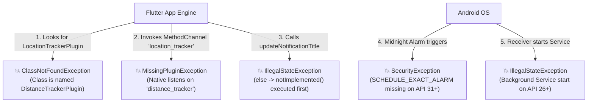

# Senior Flutter & Kotlin Engineering Audit: `location_tracker`

**Target Repository:** `location_tracker`  
**Auditor Role:** Senior Flutter & Kotlin Engineer  
**Date:** October 2026  
**Status:** 🚨 **Critical Failures Detected — Plugin is Currently Non-Functional**

---

## 1. Executive Summary

A comprehensive architectural, code quality, lifecycle, and runtime audit was conducted on the `location_tracker` Flutter plugin. 

The plugin attempts to deliver foreground-service-based background location tracking, Kalman filtering for GPS jitter smoothing, persistent daily distance tracking via Room DB, and midnight rollover alarms. 

However, in its current state, **the plugin cannot compile, cannot be registered by Flutter, and would crash at runtime** across multiple layers due to class/package mismatches, channel naming discrepancies, broken coroutine state synchronization, and unhandled Android 12–15 platform restrictions.

### Scorecard

| Domain | Rating | Status | Key Highlights |
| :--- | :---: | :---: | :--- |
| **Build & Compilation** | **F** | 🔴 Broken | Hardcoded Linux path in Gradle; broken package imports; missing class in tests. |
| **Flutter Plugin Integration** | **F** | 🔴 Broken | Plugin class name mismatch; channel name mismatch; API method name mismatch. |
| **Android Architecture & Lifecycle** | **D** | 🟠 Severe | Fragmented Service lifecycle; untracked WakeLocks; race conditions in Room writes. |
| **OS Compliance (Android 12–15)** | **D-** | 🔴 Risky | Foreground service start restrictions; exact alarm permission violation; unnecessary background location permission. |
| **Battery & Performance** | **C-** | 🟡 Poor | 10-minute WakeLock; redundant Room query on every GPS point; heavy Compose/Maps dependencies. |
| **Dart Architecture & API Design** | **D+** | 🟠 Suboptimal | Untyped maps; raw string exceptions; lack of `EventChannel` for real-time streaming. |

---

## 2. 🚨 Critical Blockers & Build / Runtime Crashes

These issues prevent the plugin from building or executing even a single method call:



### 2.1. Plugin Class Name Mismatch (`ClassNotFoundException`)
* **Location:** `pubspec.yaml` vs `LocationTrackerPlugin.kt`
* **Issue:** 
  `pubspec.yaml` registers:
  ```yaml
  pluginClass: LocationTrackerPlugin
  ```
  In Kotlin, the class is declared as:
  ```kotlin
  class DistanceTrackerPlugin : FlutterPlugin, MethodCallHandler, ActivityAware
  ```
* **Impact:** Flutter's generated plugin registrant attempts to instantiate `com.harmonyloop.location_tracker.LocationTrackerPlugin` via reflection. The app will immediately crash on startup with `ClassNotFoundException`.

### 2.2. MethodChannel Identity Mismatch (`MissingPluginException`)
* **Location:** `lib/location_tracker_method_channel.dart` vs `LocationTrackerPlugin.kt`
* **Dart Channel:** `'location_tracker'`
* **Kotlin Channel:** `'distance_tracker'`
* **Impact:** Even if registered, every method invocation fails with:
  `MissingPluginException(No implementation found for method ... on channel location_tracker)`

### 2.3. Package Name & Import Inconsistencies
* **Location:** `LocationTrackerPlugin.kt`, `LocationRepository.kt`, `android/build.gradle`
* **Issue:** 
  The project is located in package `com.harmonyloop.location_tracker`. However:
  - Files import non-existent `com.example.distance_tracker.*`.
  - `build.gradle` defines `group = "com.example.distance_tracker"` and `namespace = "com.example.distance_tracker"`.
  - `AndroidManifest.xml` declares service as `com.example.distance_tracker.DistanceTrackingService` and receiver as `.kotlin.com.harmonyloop.location_tracker.MidnightStopReceiver`.
* **Impact:** Clean builds will fail with unresolved imports; runtime launches will fail with `ClassNotFoundException` when starting the service or receiver.

### 2.4. Control Flow Bug in `onMethodCall` (`IllegalStateException`)
* **Location:** `LocationTrackerPlugin.kt`
* **Code:**
  ```kotlin
  when (call.method) {
      "startTracking" -> ...
      "stopTracking" -> ...
      else -> result.notImplemented() // Executes for updateNotificationTitle!
  }
  if (call.method == "updateNotificationTitle") {
      ...
      result.success(true) // Second response sent!
      return
  }
  ```
* **Impact:** If `updateNotificationTitle` is invoked, `result.notImplemented()` runs first, followed immediately by `result.success(true)`. In Flutter's platform channel bindings, responding twice throws `IllegalStateException: Reply already submitted`.

### 2.5. Method Contract Divergence
* **Location:** `lib/location_tracker.dart` vs `LocationTrackerPlugin.kt`

| Dart Invocation | Kotlin Handler Expected | Result |
| :--- | :--- | :--- |
| `getPlatformVersion` | *(Missing in Kotlin)* | `notImplemented()` |
| `getLocationData` | `getLastKnownLocation` | `notImplemented()` |
| `getTotalDistance` | `getDistanceToday` | `notImplemented()` |
| `updateNotificationTitle` | `updateNotificationTitle` | Crashes with double reply |

### 2.6. Hardcoded Local Machine Path in `build.gradle`
* **Location:** `android/build.gradle`
* **Code:**
  ```groovy
  maven {
      url "${System.env.HOME}/Tools/flutter_linux_3.29.2-stable/.android/Flutter"
  }
  ```
* **Impact:** Completely breaks compilation on any machine other than the original author's local Linux installation (fails on macOS, Windows, CI runners).

---

## 3. 📱 Android Native & Kotlin Architecture Deep-Dive

### 3.1. Concurrency & Room Database Race Conditions
In `localDatabase.kt` and `LocationRepository.kt`:

1. **Unscoped Coroutines:**
   ```kotlin
   CoroutineScope(Dispatchers.IO).launch {
       dao.insertOrUpdate(DailyDistanceEntity(today, distance))
       dao.deleteOldest()
   }
   ```
   Spawning unmanaged `CoroutineScope(Dispatchers.IO)` creates orphan jobs that ignore service lifecycle and cannot be canceled or joined.
2. **Data Corruption Bug:**
   In `LocationRepository.kt`, `saveLocationToDatabase(filtered, distance)` passes the **incremental delta distance** (e.g. `1.2` meters) to `DistanceStorage.saveTodayDistance()`.
   Simultaneously in `LocationService.kt`, `DistanceStorage.saveTodayDistance(totalDistance)` is called with the **accumulated total distance**.
   Because both run asynchronously on `Dispatchers.IO` without transactional guarantees or ordering, they race against each other. The database randomly overwrites today's total distance with a single step's delta.
3. **Inefficient Pruning:**
   Calling `dao.deleteOldest()` on every single GPS point creates unnecessary SQLite subquery overhead every 4–8 seconds.

### 3.2. Dangerous WakeLock Strategy
In `LocationService.kt`:
```kotlin
wakeLock?.acquire(10 * 60 * 1000L) // 10 minutes wake lock
```
* FusedLocationProvider already manages internal hardware wakefulness when delivering locations.
* Holding a `PARTIAL_WAKE_LOCK` continuously for 10 minutes while requesting GPS updates at 4s–8s intervals prevents the SoC from entering low-power sleep states.
* On modern Android devices, this will trigger **Android Vitals "Excessive Wake Locks"** alerts in the Google Play Console and lead to aggressive OEM task-killing (Samsung, Xiaomi, Huawei).

### 3.3. Android 12–15 Background & Foreground Service Restrictions
1. **Midnight Alarm Crash:**
   `DistanceTrackingService.scheduleMidnightAlarm` uses `setExactAndAllowWhileIdle()`.
   On Android 12+ (API 31+), calling this requires `android.permission.SCHEDULE_EXACT_ALARM` or `USE_EXACT_ALARM`. Neither is present in `AndroidManifest.xml`. Calling this will throw `SecurityException`.
2. **Illegal `startService` from BroadcastReceiver:**
   In `MidnightStopReceiver.kt`:
   ```kotlin
   context.startService(stopIntent)
   ```
   On Android 8.0+ (API 26+), an app in the background cannot start background services. This throws `IllegalStateException: Not allowed to start service Intent`.
3. **Android 14 (API 34) Foreground Service Type Location:**
   While `foregroundServiceType="location"` is declared, starting it when the app is in the background will throw `ForegroundServiceStartNotAllowedException` unless started while the app is in the foreground.

### 3.4. Over-Permissioning (`ACCESS_BACKGROUND_LOCATION`)
* Manifest declares `<uses-permission android:name="android.permission.ACCESS_BACKGROUND_LOCATION" />`.
* Because this plugin uses a **Foreground Service** (`FOREGROUND_SERVICE_LOCATION`), it operates under "while-in-use" location rights.
* Requesting background location triggers mandatory Google Play Location Disclosure & Review processes, which are unnecessary for foreground services and frequently result in app rejection if unjustified.

### 3.5. Bloated & Unused Dependencies
In `android/build.gradle`:
* `implementation("androidx.activity:activity-compose:1.9.3")` — Compose is completely unused and adds megabytes to consumer APK size.
* `implementation("com.google.android.gms:play-services-maps:18.2.0")` — Maps SDK is not used.
* `kapt` is used instead of Kotlin Symbol Processing (`ksp`), slowing down Room annotation generation.

---

## 4. 💙 Flutter & Dart Architecture Deep-Dive

### 4.1. Error Handling Anti-Pattern
In `lib/location_tracker_method_channel.dart`:
```dart
try {
  await _channel.invokeMethod('startTracking');
} on PlatformException catch (e) {
  throw 'Failed to start tracking: ${e.message}'; // ANTI-PATTERN: Throwing string
}
```
* Throwing raw strings breaks exception hierarchies, strips stack traces, and prevents consumers from writing structured `catch (e is LocationTrackerException)` handlers.

### 4.2. Lack of Event Streaming (`EventChannel`)
* Location tracking is inherently continuous. Currently, Flutter must resort to polling `getLocationData()` or `getTotalDistance()`.
* Best practice for location plugins is providing an `EventChannel` exposing:
  ```dart
  Stream<LocationModel> get onLocationChanged;
  Stream<TrackingStatus> get onStatusChanged;
  ```

### 4.3. Missing Data Contracts
* `getLocationData()` returns an untyped `Map<String, dynamic>?`.
* Keys are undocumented and prone to nullability and parsing issues.
* Should be wrapped in an immutable typed model:
  ```dart
  class LocationPoint {
    final double latitude;
    final double longitude;
    final double speed;
    final DateTime timestamp;
    ...
  }
  ```

---

## 5. Remediation Plan

### Phase 1: Build & Plumbing Alignment (Immediate)
1. **Unify Package Namespace:** Standardize exclusively on `com.harmonyloop.location_tracker`.
2. **Rename Plugin Class:** Rename `DistanceTrackerPlugin` in Kotlin to `LocationTrackerPlugin` to match `pubspec.yaml`.
3. **Align Channel Name:** Set channel name to `'location_tracker'` in both Dart and Kotlin.
4. **Fix Method Router:** Fix `onMethodCall` in Kotlin to prevent double-reply on `updateNotificationTitle`, and synchronize method names.
5. **Clean Gradle:** Delete `allprojects.maven` pointing to local Linux paths. Drop Jetpack Compose and Google Maps dependencies.

### Phase 2: Android Stability & Concurrency (High Priority)
1. **Fix Room DB Synchronization:** Eliminate delta saving from `LocationRepository`. Use a single CoroutineScope tied to the Service lifecycle. Only execute `deleteOldest()` once a day during rollover.
2. **Refactor WakeLock:** Remove long-lived 10-minute partial wake locks. Rely on `LocationRequest.setPriority(Priority.PRIORITY_HIGH_ACCURACY)`.
3. **Fix Alarms & Receivers:** Replace exact alarms with in-service scheduling or WorkManager.

### Phase 3: Flutter / Dart Modernization (Quality of Life)
1. **EventChannel:** Implement `EventChannel` for real-time location stream and tracking status.
2. **Typed Entities:** Create `TrackingConfig`, `LocationPoint`, `TrackingStatus` enum, and custom `LocationTrackerException` classes in Dart.
